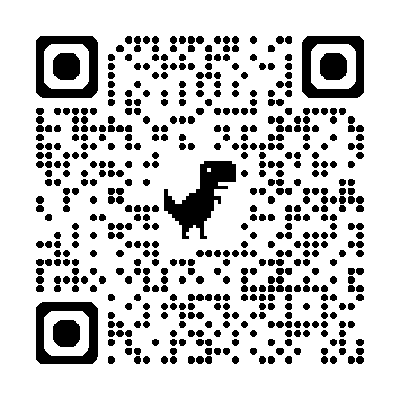

# ソムニ sommNI

<p align="center">
  
  <br>
  <em>Scan with Even Realities app</em>
</p>

**Seven Second Sommelier** — A wine tasting notes app for Even Realities G2 smart glasses.


## Overview

sommNI puts a sommelier in your glasses. Browse 215 wines by type, country, and style. Get instant tasting notes — appearance, nose, palate, finish, and fun anecdotes — all hands-free while dining.

### Try It

Scan with the Even Realities app or visit:
```
https://d3hospitality.github.io/sommNI/
```

## Features

- 🍷 **215 wines** across Red, White, Sparkling, Rosé, Orange & Dessert
- 🎤 **Voice search** — double-tap and say the wine name (3 sec listening)
- 📜 **Detailed tasting notes** with sommelier anecdotes
- 💍 **Ring navigation** with scroll and click
- ⚡ **Instant lookup** — find any wine in seconds

## Controls

| Page | Single Click | Double Click | Scroll |
|------|--------------|--------------|--------|
| Home | Select wine type | 🎤 Voice search | Navigate list |
| Countries | Select country | 🎤 Voice search | Navigate list |
| Styles | Select style | 🎤 Voice search | Navigate list |
| Wines | Select wine | 🎤 Voice search | Navigate list |
| Notes | — | ‹ Back | Scroll notes |

### Voice Search

Double-tap on any page (except Notes) to activate voice search:
1. Say the wine name: *"Opus One"*
2. Or use keywords: *"red Cabernet from Napa"*
3. sommNI finds the best match and shows the tasting notes

**Supported keywords:** red, white, sparkling, rosé, orange, dessert

## Screenshots

*Coming soon*

## Development

### Requirements

- Node.js 18+
- Even Hub CLI (`npm install -g @aspect-build/evenhub-cli`)
- OpenAI API key (for voice search)

### Setup

```bash
git clone https://github.com/d3hospitality/sommNI.git
cd sommNI

npm install

# Create .env file with your OpenAI key
echo "VITE_OPENAI_API_KEY=your-key-here" > .env

# Run locally
npm run dev

# In another terminal, start the simulator
evenhub-simulator http://localhost:5173
```

### Build & Deploy

```bash
npm run build
npx gh-pages -d dist
```

### Package for Even Hub

```bash
npm run build
evenhub pack app.json dist
# Creates out.ehpk - upload to evenhub.evenrealities.com
```

## Tech Stack

- **Vite + TypeScript**
- **@evenrealities/even_hub_sdk** for G2 integration
- **OpenAI gpt-4o-transcribe** for voice recognition

---

## Roadmap

### v0.2.0 — Polish
- [ ] 🔴 **Listening indicator** — visual blip when voice search is active
- [ ] 🔄 **Fix inverted scroll** — resolve ring scroll direction issue
- [ ] 📱 **Improved voice feedback** — audio/haptic confirmation

### v0.3.0 — Personalization
- [ ] ⭐ **Favorites** — save wines you love
- [ ] 📝 **Personal notes** — add your own tasting notes
- [ ] 🕐 **Recently viewed** — quick access to recent wines

### v1.0.0 — Restaurant Platform
- [ ] 🏠 **Wine Libraries** — login to your restaurant's wine collection
- [ ] 🍽️ **Multi-restaurant support** — switch between venues
- [ ] 📊 **Admin dashboard** — manage wine inventory
- [ ] 🔄 **Sync** — real-time updates across devices
- [ ] 👥 **Team accounts** — staff access levels

### Future Ideas
- [ ] 🍕 **Food pairings** — suggest wines for dishes
- [ ] 📸 **Label scanning** — identify wines by photo
- [ ] 💰 **Price integration** — display wine prices
- [ ] 🌍 **Multi-language** — sommelier notes in your language

---

## Contributing

Pull requests welcome! For major changes, open an issue first.

## License

MIT © D3 Hospitality

---

*Built for the Even Realities G2 smart glasses*
